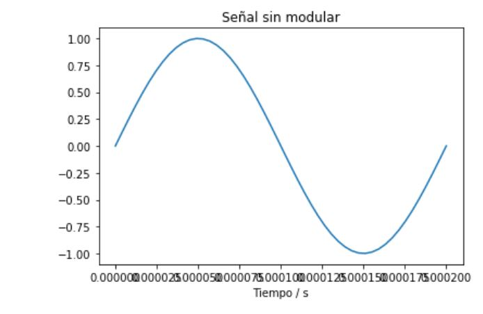
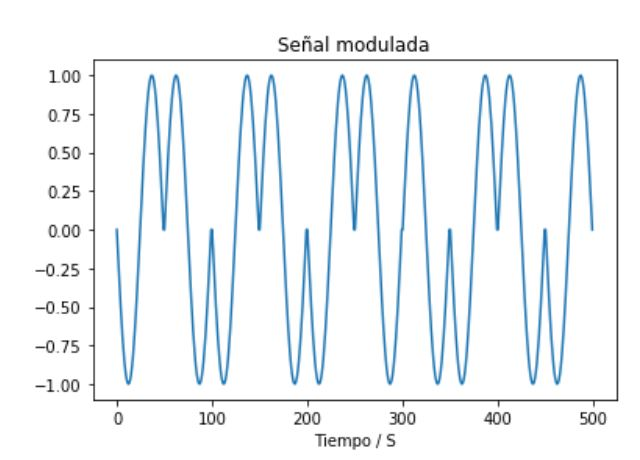
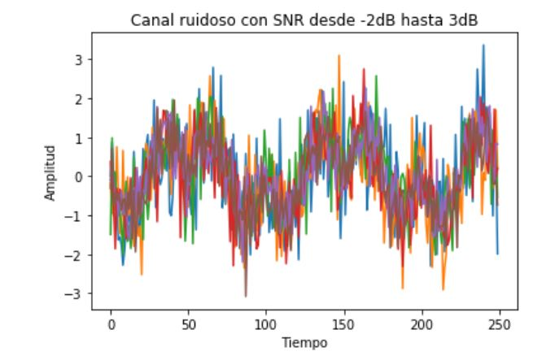
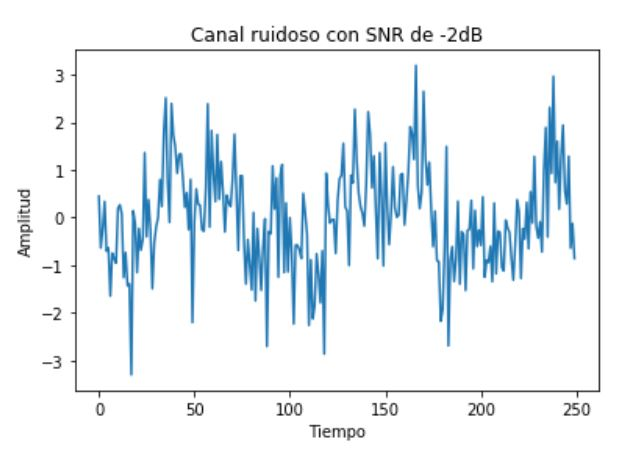
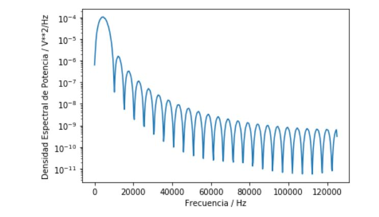
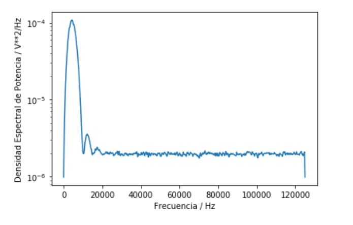
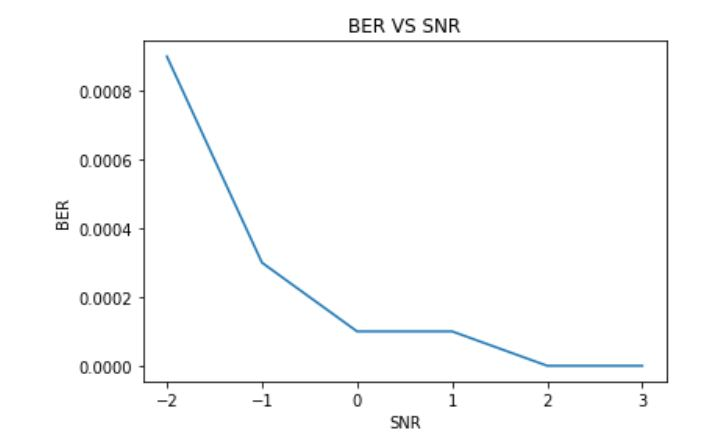

###Universidad de Costa Rica 

###Escuela de Ingeniería Eléctrica

###IE405- Modelos Probabilísticos de Señales y Sistemas 

###Tarea 4
###Jennifer Cascante Peraza  B51626

-Punto 1: Crear un esquema de modulación BPSK para los bits presentados. Esto implica asignar una forma de onda sinusoidal normalizada (amplitud unitaria) para cada bit y luego una concatenación de todas estas formas de onda.

-Punto 2: Calcular la potencia promedio de la señal modulada generada.

-Punto 3:  Simular un canal ruidoso del tipo AWGN (ruido aditivo blanco gaussiano) con una relación señal a ruido (SNR) desde -2 hasta 3 dB.

-Punto 4: Graficar la densidad espectral de potencia de la señal con el método de Welch (SciPy), antes y después del canal ruidoso.

-Punto 5: Demodular y decodificar la señal y hacer un conteo de la tasa de error de bits (BER, bit error rate) para cada nivel SNR.

-Punto 6: Graficar BER versus SNR.

